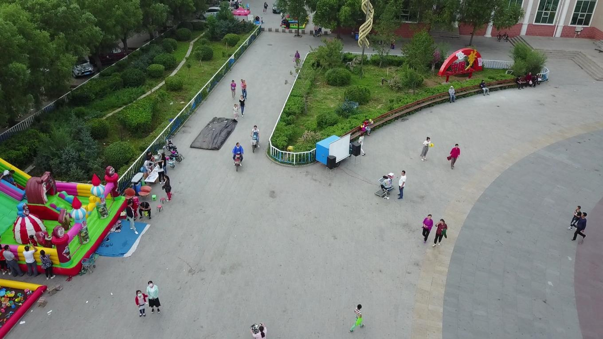
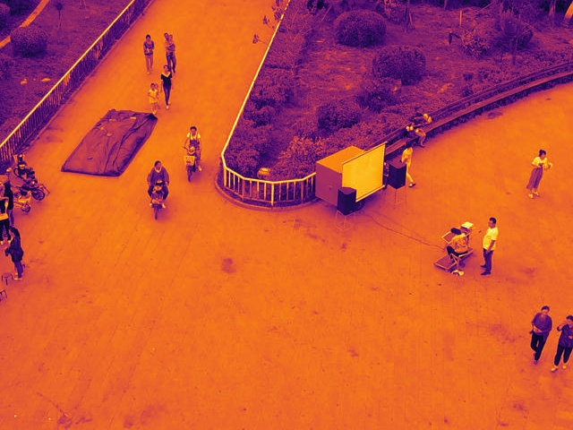
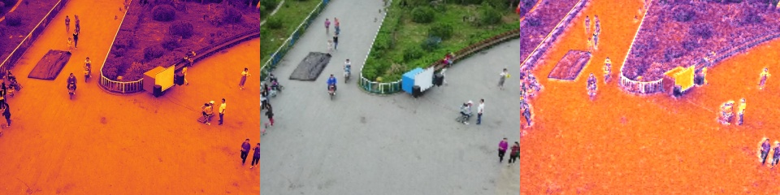

# VisualFusion LibTorch

🔥 **Real-Time EO-IR Image Alignment and Fusion System**

[](https://isocpp.org/)
[](https://opencv.org/)
[](https://pytorch.org/)
[](https://onnx.ai/)

## 🚀 Overview

VisualFusion LibTorch is a computer vision system for **EO-IR (Electro-Optical/Infrared) image alignment and fusion**. It uses deep learning models to detect feature points and compute homography matrices for accurate image registration, then creates fused outputs with advanced edge-preserving algorithms.

### 🎨 Demo

Input images and fusion result:

| EO (Electro-Optical) | IR (Infrared) |
|:---:|:---:|
|  |  |

<div align="center">
  
  <br>
  <em>Fusion Result</em>
</div>

### ✨ Key Features

- 🎯 **Deep Learning Feature Detection**: Uses SemLA model for keypoint detection and matching
- 🖼️ **EO-IR Image Fusion**: Seamless fusion with shadow enhancement and edge preservation  
- 📐 **RANSAC Homography**: Robust estimation with outlier filtering
- 🎛️ **Homography Smoothing**: Temporal consistency with configurable smoothing parameters
- ⚙️ **Video & Image Cropping**: Support for VideoCut and PictureCut parameters
- 📊 **Performance Timing**: Built-in timer analysis for each processing stage

## 🏗️ Architecture

```
VisualFusion_libtorch/
├── IR_Convert_v21_libtorch/    # LibTorch implementation 
├── Onnx/                       # ONNX Runtime implementation
├── tensorRT/                   # TensorRT implementation (WIP)
└── convert_to_libtorch/        # Model conversion utilities
```

### 🔧 Supported Inference Engines

| Engine | Status | Model Format | Device Support | Implementation |
|--------|--------|--------------|----------------|----------------|
| **LibTorch** | ✅ Ready | `.zip` (TorchScript) | CPU/CUDA | Full C++ implementation |
| **ONNX Runtime** | ✅ Ready | `.onnx` | CPU | Full C++ implementation |
| **TensorRT** | ✅ Ready | `.trt` | CUDA | Optimized GPU inference |

## 📋 Requirements

### System Dependencies
- **OS**: Ubuntu 20.04+ 
- **CPU**: Multi-core processor
- **Memory**: 4GB RAM minimum
- **GPU**: NVIDIA GPU with CUDA support (required for TensorRT)

### Software Dependencies
- **C++ Compiler**: GCC 9+
- **CMake**: 3.18+
- **OpenCV**: 4.5+
- **CUDA**: 11.4+ (for TensorRT)
- **TensorRT**: 8.6.1.6+ (for TensorRT version)
- **LibTorch**: 2.0+ (for LibTorch version)
- **ONNX Runtime**: 1.15+ (for ONNX version)

## 🛠️ Installation & Usage

### LibTorch Version

```bash
cd IR_Convert_v21_libtorch

# Build the project
bash gcc.sh

# Run with configuration
./build/out config/config.json
```

### ONNX Runtime Version  

```bash
cd Onnx

# Build the project
bash gcc.sh

# Run with configuration  
./build/out config/config.json
```

### TensorRT Version

```bash
cd tensorRT

# Build the project (requires CUDA and TensorRT)
bash gcc.sh

# Run with configuration
./out config/config.json
```

#### TensorRT Model Conversion

```bash
# Convert ONNX model to TensorRT engine
cd convert_to_libtorch
python export_onnx2tensorRT.py \
    --onnx /path/to/model.onnx \
    --trt /path/to/output.trt \
    --workspace-size 1024
```

## ⚙️ Configuration

### TensorRT Configuration

```json
{
    "input_dir": "/path/to/input",
    "output_dir": "/path/to/output", 
    "output": true,
    
    "device": "cpu",
    "pred_mode": "fp32",
    "model_path": "/path/to/model.trt",
    
    "output_width": 320,
    "output_height": 240,
    "pred_width": 320, 
    "pred_height": 240,
    
    "VideoCut": true,
    "Vcut_x": 870,
    "Vcut_y": 235, 
    "Vcut_w": 2020,
    "Vcut_h": 1680,
    
    "PictureCut": true,
    "Pcut_x": 220,
    "Pcut_y": 0,
    "Pcut_w": 1920,
    "Pcut_h": 1080,
    
    "fusion_shadow": true,
    "fusion_edge_border": 2,
    "fusion_threshold_equalization": 128,
    "fusion_threshold_equalization_low": 72,
    "fusion_threshold_equalization_high": 192,
    "fusion_threshold_equalization_zero": 64,
    "fusion_interpolation": "cubic",
    
    "perspective_check": true,
    "perspective_distance": 10,
    "perspective_accuracy": 0.85,
    
    "align_distance_last": 15.0,
    "align_distance_line": 10.0,
    "align_angle_mean": 10.0,
    "align_angle_sort": 0.7,
    
    "smooth_max_translation_diff": 80.0,
    "smooth_max_rotation_diff": 0.05,
    "smooth_alpha": 0.05
}
```

### Core Parameters

```json
{
    "input_dir": "/path/to/input",
    "output_dir": "/path/to/output", 
    "output": true,
    
    "device": "cuda",
    "pred_mode": "fp32",
    "model_path": "./model/SemLA_jit_cuda.zip",
    
    "output_width": 320,
    "output_height": 240,
    "pred_width": 320, 
    "pred_height": 240
}
```

### Video/Image Cropping

```json
{
    "VideoCut": true,
    "Vcut_x": 870,
    "Vcut_y": 235, 
    "Vcut_w": 2020,
    "Vcut_h": 1680,
    
    "PictureCut": true,
    "Pcut_x": 220,
    "Pcut_y": 0,
    "Pcut_w": 1920,
    "Pcut_h": 1080
}
```

### Fusion Settings

```json
{
    "fusion_shadow": true,
    "fusion_edge_border": 2,
    "fusion_threshold_equalization": 128,
    "fusion_threshold_equalization_low": 72,
    "fusion_threshold_equalization_high": 192,
    "fusion_threshold_equalization_zero": 64,
    "fusion_interpolation": "cubic"
}
```

### Perspective & Alignment

```json
{
    "perspective_check": true,
    "perspective_distance": 10,
    "perspective_accuracy": 0.85,
    
    "align_distance_last": 15.0,
    "align_distance_line": 10.0,
    "align_angle_mean": 10.0,
    "align_angle_sort": 0.7
}
```

### Homography Smoothing

```json
{
    "smooth_max_translation_diff": 80.0,
    "smooth_max_rotation_diff": 0.05,
    "smooth_alpha": 0.05
}
```

## 📁 Input Format

The system expects paired EO-IR images with `_EO` and `_IR` suffixes:

```
input/
├── scene_001_EO.jpg
├── scene_001_IR.jpg
├── scene_002_EO.jpg  
└── scene_002_IR.jpg
```

## 🎮 Processing Pipeline

### TensorRT Implementation Pipeline

1. **Configuration Loading**: Reads JSON configuration with all processing parameters
2. **Input Processing**: 
   - Supports both video files and image pairs (`_EO`/`_IR` suffix convention)
   - Automatic file pair detection and validation
3. **Image Preprocessing**:
   - **VideoCut/PictureCut**: Configurable region cropping from source images
   - **Resizing**: Scale images to output dimensions (320×240 default)
   - **Color Space**: Convert to grayscale for model inference
4. **TensorRT Feature Detection**:
   - **Model**: SemLA model compiled to TensorRT engine (`.trt` format)
   - **Input**: Two grayscale images (320×240)
   - **Output**: Fixed 1200 keypoints with validity mask
   - **Inference**: CUDA-accelerated execution with FP32 precision
5. **Feature Point Processing**:
   - **Coordinate Transformation**: Scale from model space to output image space
   - **Point Filtering**: Remove invalid points based on model output length
   - **RANSAC**: Robust homography estimation with 8.0px threshold
6. **Homography Smoothing**:
   - **Translation Check**: Maximum allowed pixel difference (80.0px default)
   - **Rotation Check**: Maximum allowed rotation difference (0.05 rad default)
   - **Temporal Smoothing**: Weighted average with previous frames (α=0.05)
   - **Fallback Handling**: Force reset after 3 consecutive rejections
7. **Edge Enhancement**:
   - **Canny Edge Detection**: Multi-threshold edge extraction
   - **Perspective Transform**: Apply homography to EO edge map
8. **Image Fusion**:
   - **Shadow Enhancement**: Histogram equalization with multiple thresholds
   - **Interpolation**: Configurable linear/cubic resampling
   - **Alpha Blending**: Edge-aware fusion with shadow processing
9. **Output Generation**:
   - **Feature Visualization**: Side-by-side images with matched keypoints
   - **Fusion Result**: Combined EO-IR output with edge enhancement
   - **Performance Timing**: Detailed timing analysis for each processing stage

### Key Processing Features

- **Frame-based Processing**: Compute features every N frames (configurable)
- **Robust Error Handling**: Graceful fallback for insufficient feature points
- **Memory Management**: Efficient CUDA memory handling with stream processing
- **Debug Output**: Comprehensive logging with `debug:` prefix for troubleshooting

## 🔍 Algorithm Components

### TensorRT Feature Matching
- **Model**: SemLA (Semantic Line Association) compiled to TensorRT engine
- **Input Format**: Two grayscale images (1, 1, 240, 320) in CHW format
- **Preprocessing**: BGR→Gray→Resize→Normalize(/255.0)→HWC to CHW conversion
- **Output Tensors**:
  - `pred_keypoints0`: IR keypoints [1, 1200, 2] (int32)
  - `pred_keypoints1`: EO keypoints [1, 1200, 2] (int32) 
  - `pred_leng1`: Valid keypoint count [1] (int32)
  - `pred_leng2`: Secondary count [1] (int32)
- **Post-processing**: 
  - Coordinate scaling with configurable scale factors
  - Point filtering based on `pred_leng1` validity
  - RANSAC homography with 8.0px threshold and 0.98 confidence

### Homography Smoothing
- **Translation Threshold**: Configurable max pixel difference
- **Rotation Threshold**: Configurable max radians difference  
- **Smoothing Factor**: Weighted average with previous frames
- **Fallback Logic**: Handles large motion discontinuities

### Image Fusion
- **Edge Enhancement**: Canny edge detection with adaptive thresholds
- **Shadow Processing**: Histogram equalization with multiple threshold levels
- **Interpolation**: Linear or cubic resampling options
- **Blending**: Alpha composition with edge-aware weights

## 📊 Performance

### TensorRT Optimization
- **Engine Format**: Optimized `.trt` engine files for target GPU
- **Precision**: FP32 (configurable to FP16 for faster inference)
- **Memory**: Fixed input shapes eliminate dynamic memory allocation
- **Throughput**: Significant speedup over ONNX Runtime on CUDA devices

### Timing Analysis
The TensorRT system includes detailed timing for each processing stage:
- **Resize**: Image scaling operations
- **Gray Conversion**: Color space transformation
- **TensorRT Inference**: Model prediction time
- **Homography Computation**: RANSAC estimation
- **Edge Detection**: Canny edge extraction
- **Perspective Transformation**: Homography application
- **Image Fusion**: Final blending operations

### Tested Configurations
- **Primary Resolution**: 320×240 (optimized for real-time processing)
- **Model Output**: Fixed 1200 keypoints per image pair
- **GPU Memory**: ~2GB VRAM for engine loading and inference
- **Processing Rate**: Real-time capable on modern NVIDIA GPUs

## 🐛 Troubleshooting

### TensorRT Specific Issues

**Engine Loading Errors**
```bash
# Verify TensorRT installation
ls -la /opt/TensorRT-8.6.1.6/lib/
# Check CUDA compatibility
nvidia-smi
nvcc --version
```

**Model Conversion Issues**
```bash
# Regenerate TensorRT engine with explicit precision
python export_onnx2tensorRT.py \
    --onnx /path/to/model.onnx \
    --trt /path/to/output.trt \
    --fp16  # Remove this flag for FP32 precision
```

**CUDA Memory Errors**
```bash  
# Monitor GPU memory usage
nvidia-smi -l 1
# Reduce batch size or image resolution if needed
```

**Feature Detection Issues**
```bash
# Check model path in config.json
grep "model_path" config/config.json
# Verify engine file exists and is readable
ls -la model/trtModel/*.trt
```

**Poor Alignment Quality**
```bash
# Adjust RANSAC parameters in config.json
# Increase perspective_accuracy (0.85 → 0.95)
# Decrease smooth_alpha for more stable tracking (0.05 → 0.02)
# Increase smooth_max_translation_diff for more flexible tracking
```

## 🔧 Development

### TensorRT Build System
- **CMake**: Version 3.18+ with CUDA and TensorRT integration
- **Dependencies**: Automatic linking of TensorRT, CUDA, and OpenCV libraries
- **Build Script**: Custom `gcc.sh` for simplified compilation

### Code Structure
- `main.cpp`: Main processing pipeline with homography smoothing
- `lib_image_fusion/src/core_image_align_tensorrt.cpp`: TensorRT inference engine
- `lib_image_fusion/include/core_image_align_tensorrt.h`: TensorRT interface definition
- `utils/`: Performance timing utilities
- `nlohmann/`: JSON configuration parsing
- `config/config.json`: Runtime configuration parameters

### Key Implementation Details
- **PIMPL Pattern**: Clean interface separation for TensorRT integration
- **CUDA Stream**: Asynchronous GPU processing for optimal performance
- **Memory Management**: Efficient host/device memory allocation
- **Error Handling**: Comprehensive logging with debug output
- **Thread Safety**: Safe multi-threaded processing support