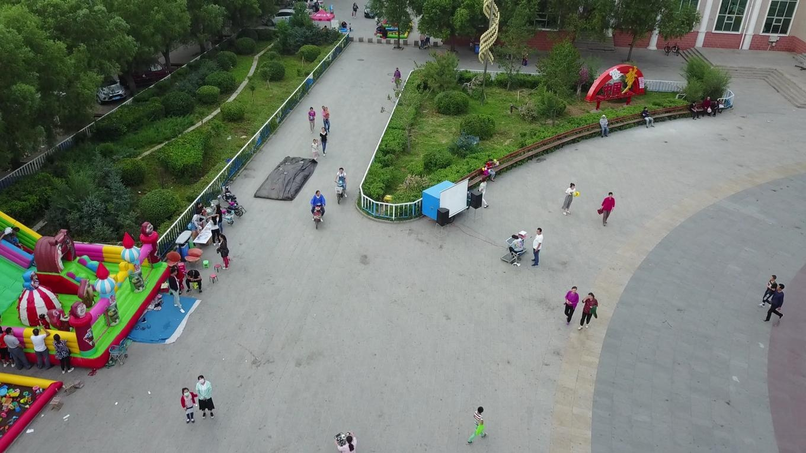
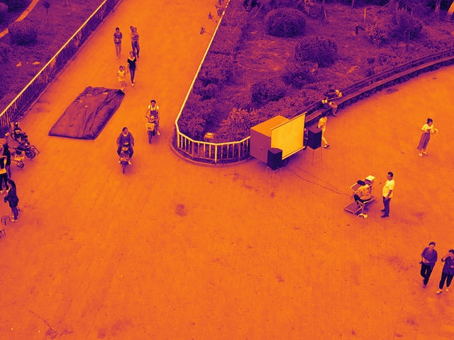
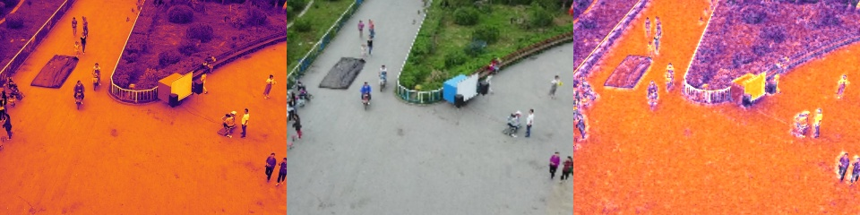

# VisualFusion 

🔥 **Real-Time EO-IR Image Alignment and Fusion System with Deep Learning**


## 🚀 Overview

VisualFusion is a high-performance computer vision system for **EO-IR (Electro-Optical/Infrared) image alignment and fusion**. It leverages deep learning models (SemLA) to detect corresponding feature points between EO-IR image pairs, computes robust homography matrices using RANSAC, and generates high-quality fused outputs with advanced edge-preserving algorithms.

### 🎨 Demo

Input images and fusion result:

| EO (Electro-Optical) | IR (Infrared) |
|:---:|:---:|
|  |  |

<div align="center">
  
  <br>
  <em>Fusion Result</em>
</div>

### ✨ Key Features

- 🎯 **Deep Learning Feature Detection**: SemLA model for accurate keypoint detection and matching
- 🖼️ **EO-IR Image Fusion**: Seamless fusion with shadow enhancement and edge preservation
- 📐 **RANSAC Homography**: Robust estimation with outlier filtering
- 🎛️ **Homography Smoothing**: Temporal consistency with configurable smoothing parameters
- ⚙️ **Flexible Cropping**: Support for VideoCut and PictureCut parameters
- 📊 **Performance Timing**: Built-in profiling for each processing stage
- 🚄 **FP16 Support**: Half-precision inference for faster GPU performance

## 🏗️ Project Structure

```
VisualFusion_libtorch/
├── IR_Convert_v21_libtorch/    # LibTorch C++ implementation (Main)
│   ├── main.cpp                 # Main processing pipeline
│   ├── config/                  # Configuration files
│   │   └── config.json          # Runtime configuration
│   ├── lib_image_fusion/        # Core computer vision libraries
│   │   ├── include/             # Header files
│   │   └── src/                 # Implementation
│   │       ├── core_image_align_libtorch.cpp  # LibTorch inference
│   │       ├── core_image_fusion.cpp          # Image fusion algorithms
│   │       ├── core_image_perspective.cpp     # Perspective transformation
│   │       ├── core_image_resizer.cpp         # Image resizing
│   │       └── core_image_to_gray.cpp         # Grayscale conversion
│   ├── model/                   # Model files
│   │   ├── SemLA_fp16.zip       # FP16 TorchScript model
│   │   └── SemLA_fp32.zip       # FP32 TorchScript model
│   ├── utils/                   # Utility functions
│   ├── build/                   # Build artifacts
│   └── gcc.sh                   # Build script
│
├── Onnx/                        # ONNX Runtime implementation
│   ├── main.cpp                 # ONNX Runtime pipeline
│   ├── lib_image_fusion/        # Core libraries (similar structure)
│   └── model/                   # ONNX models
│
├── tensorRT/                    # TensorRT implementation
│   ├── main.cpp                 # TensorRT pipeline
│   ├── lib_image_fusion/        # Core libraries
│   └── model/                   # TensorRT engines
│
└── convert_to_libtorch/         # Model conversion utilities
    ├── export_to_jit_fp16.py    # PyTorch → LibTorch FP16
    ├── export_to_jit_fp32.py    # PyTorch → LibTorch FP32
    ├── export_to_onnx_fp16.py   # PyTorch → ONNX FP16
    ├── export_to_onnx_fp32.py   # PyTorch → ONNX FP32
    ├── export_to_tensorrt_fp16.py  # PyTorch → TensorRT FP16
    ├── export_to_tensorrt_fp32.py  # PyTorch → TensorRT FP32
    ├── model_jit/               # SemLA model implementation
    └── reg.ckpt                 # Pretrained weights
```

## 🔧 Supported Inference Engines

| Engine | Status | Model Format | Precision | Device Support |
|--------|--------|--------------|-----------|----------------|
| **LibTorch** | ✅ Ready | `.zip` (TorchScript) | FP32/FP16 | CPU/CUDA |
| **ONNX Runtime** | ✅ Ready | `.onnx` | FP32/FP16 | CPU/CUDA |
| **TensorRT** | ✅ Ready | `.engine` | FP32/FP16 | CUDA |

## 📋 Requirements

### System Dependencies
- **OS**: Ubuntu 20.04+ (tested on Ubuntu 20.04.6 LTS)
- **CPU**: Multi-core processor
- **Memory**: 4GB RAM minimum, 8GB+ recommended
- **GPU**: NVIDIA GPU with CUDA 11.x support (optional, for GPU acceleration)

### Software Dependencies

#### C++ Build Tools
- **GCC**: 9.0+
- **CMake**: 3.18+
- **OpenCV**: 4.5+

#### Python Environment
- **Python**: 3.8+
- **PyTorch**: 1.13.1
- **ONNX**: 1.14+
- **onnxruntime**: 1.18.0
- **numpy**, **opencv-python**

#### GPU Libraries (Optional)
- **CUDA**: 11.x
- **cuDNN**: 8.x
- **TensorRT**: 8.4.x (for TensorRT backend)

## 🛠️ Installation

### 1. Clone Repository

```bash
git clone <repository-url>
cd VisualFusion_libtorch
```

### 2. Install Python Dependencies

```bash
cd convert_to_libtorch
pip install torch==1.13.1 torchvision torchaudio --index-url https://download.pytorch.org/whl/cu116
pip install onnx onnxruntime-gpu==1.18.0 opencv-python numpy
```

### 3. Build LibTorch Version

```bash
cd IR_Convert_v21_libtorch
bash gcc.sh
```

The build script will:
- Download and setup LibTorch 1.13.1 (if not present)
- Compile C++ source files
- Generate executable: `./build/out`

### 4. Build ONNX Version (Optional)

```bash
cd Onnx
bash gcc.sh
```

### 5. Build TensorRT Version (Optional)

```bash
cd tensorRT
bash gcc.sh
```

**Note**: TensorRT version requires TensorRT 8.4.x libraries installed and in `LD_LIBRARY_PATH`.

## 📦 Model Conversion

The project supports multiple inference backends. Convert the pretrained model to your desired format:

### LibTorch (TorchScript)

#### FP32 Model
```bash
cd convert_to_libtorch
python export_to_jit_fp32.py
```
- **Input**: `reg.ckpt`
- **Output**: `../IR_Convert_v21_libtorch/model/SemLA_fp32.zip`
- **Format**: FP32 TorchScript
- **Use case**: CPU inference or maximum precision

#### FP16 Model (Recommended for GPU)
```bash
cd convert_to_libtorch
python export_to_jit_fp16.py
```
- **Input**: `reg.ckpt` (PyTorch checkpoint)
- **Output**: `../IR_Convert_v21_libtorch/model/SemLA_fp16.zip`
- **Format**: FP16 TorchScript
- **Use case**: GPU inference with Tensor Core acceleration
- **Pipeline**: PyTorch FP16 → LibTorch FP16 (direct export)

### ONNX Runtime

#### FP32 Model
```bash
cd convert_to_libtorch
python export_to_onnx_fp32.py
```
- **Output**: `../Onnx/model/SemLA_onnx_opset12_fp32.onnx`

#### FP16 Model
```bash
cd convert_to_libtorch
python export_to_onnx_fp16.py
```
- **Output**: `../Onnx/model/onnx_op12_fp16.onnx`

### TensorRT

#### FP32 Engine
```bash
cd convert_to_libtorch
python export_to_tensorrt_fp32.py
```
- **Pipeline**: PyTorch FP32 → ONNX FP32 → TensorRT FP32
- **Output**: `../tensorRT/model/GPU30s/trt_semla_fp32_op12.engine`

#### FP16 Engine
```bash
cd convert_to_libtorch
python export_to_tensorrt_fp16.py
```
- **Pipeline**: PyTorch FP32 → ONNX FP32 → TensorRT FP16 (using `trtexec --fp16`)
- **Output**: `../tensorRT/model/GPU30s/trt_semla_fp16_op12.engine`

**Requirements**: TensorRT conversion requires CUDA 11.x, cuDNN 8.x, and TensorRT 8.4.x libraries installed.

**Note**: TensorRT engines are GPU-specific and should be rebuilt when moving to different hardware.

## ⚙️ Configuration

All runtime parameters are configured via `config/config.json`:

### Basic Configuration

```json
{
    "input_dir": "/path/to/input",
    "output_dir": "/path/to/output",
    "output": true,
    
    "device": "cuda",
    "pred_mode": "fp16",
    "model_path": "/path/to/model/SemLA_fp16.zip"
}
```

#### Core Parameters

| Parameter | Type | Description | Default |
|-----------|------|-------------|---------|
| `input_dir` | string | Input directory containing EO-IR image pairs | `"./input"` |
| `output_dir` | string | Output directory for results | `"./output"` |
| `output` | boolean | Enable saving output images | `false` |
| `device` | string | Inference device: `"cuda"` or `"cpu"` | `"cpu"` |
| `pred_mode` | string | Precision mode: `"fp16"` or `"fp32"` | `"fp32"` |
| `model_path` | string | Path to model file (.zip for LibTorch) | `"./model/SemLA_fp32.zip"` |

**Important**: 
- When `pred_mode="fp16"`, use `SemLA_fp16.zip` model and `device="cuda"`
- When `pred_mode="fp32"`, use `SemLA_fp32.zip` model
- FP16 mode requires CUDA device
- Model is pre-converted to FP16/FP32 in Python, C++ loads it directly

### Image Processing

```json
{
    "pred_width": 320,
    "pred_height": 240,
    "output_width": 320,
    "output_height": 240,
    
    "VideoCut": true,
    "Vcut_x": 870,
    "Vcut_y": 235,
    "Vcut_w": 2020,
    "Vcut_h": 1680,
    
    "PictureCut": true,
    "Pcut_x": 220,
    "Pcut_y": 0,
    "Pcut_w": 1920,
    "Pcut_h": 1080
}
```

| Parameter | Description |
|-----------|-------------|
| `pred_width/height` | Input size for model inference (320x240 recommended) |
| `output_width/height` | Output image dimensions |
| `VideoCut` | Enable video frame cropping |
| `Vcut_x/y/w/h` | Video crop region (x, y, width, height) |
| `PictureCut` | Enable picture cropping before fusion |
| `Pcut_x/y/w/h` | Picture crop region |

### Fusion Settings

```json
{
    "fusion_shadow": true,
    "fusion_edge_border": 2,
    "fusion_threshold_equalization": 128,
    "fusion_threshold_equalization_low": 72,
    "fusion_threshold_equalization_high": 192,
    "fusion_threshold_equalization_zero": 64,
    "fusion_interpolation": "cubic"
}
```

| Parameter | Description |
|-----------|-------------|
| `fusion_shadow` | Enable shadow enhancement |
| `fusion_edge_border` | Edge detection border width |
| `fusion_threshold_*` | Histogram equalization thresholds |
| `fusion_interpolation` | Interpolation method: `"linear"` or `"cubic"` |

### Homography & Alignment

```json
{
    "perspective_check": true,
    "perspective_distance": 6,
    "perspective_accuracy": 0.85,
    
    "align_distance_last": 15.0,
    "align_distance_line": 10.0,
    "align_angle_mean": 10.0,
    "align_angle_sort": 0.7,
    
    "smooth_max_translation_diff": 80.0,
    "smooth_max_rotation_diff": 0.05,
    "smooth_alpha": 0.05
}
```

| Parameter | Description |
|-----------|-------------|
| `perspective_check` | Enable perspective validation |
| `perspective_distance` | RANSAC inlier threshold (pixels, default: 6.0) |
| `perspective_accuracy` | Minimum inlier ratio (0.0-1.0) |
| `align_distance_*` | Feature alignment distance thresholds |
| `align_angle_*` | Angle-based filtering parameters |
| `smooth_*` | Temporal smoothing parameters |

## 🚀 Usage

### LibTorch Version

#### Prepare Input Data

Organize your EO-IR image pairs with `_EO` and `_IR` suffixes:

```
input/
├── scene_001_EO.jpg
├── scene_001_IR.jpg
├── scene_002_EO.jpg
├── scene_002_IR.jpg
...
```

#### Run Inference

```bash
cd IR_Convert_v21_libtorch
./build/out 
```

#### Output

Results are saved to the configured `output_dir`:

```
output/
├── scene_001_fusion.jpg    # Fused image
├── scene_001_aligned.jpg   # Visualization with keypoints
├── scene_002_fusion.jpg
├── scene_002_aligned.jpg
...
```

### ONNX Runtime Version

```bash
cd Onnx
./build/out 
```

### TensorRT Version

```bash
cd tensorRT
./build/out 
```

**Note**: Ensure TensorRT engine (`.engine`) is pre-built before running. See [Model Conversion](#-model-conversion) section.

## 🔍 Processing Pipeline

The system follows this processing flow:

```
┌─────────────────────────────────────────────────────────────┐
│ 1. Input Loading                                            │
│    - Read EO-IR image pairs from input directory            │
└─────────────────────────────┬───────────────────────────────┘
                              │
┌─────────────────────────────▼───────────────────────────────┐
│ 2. Video/Image Cropping (Optional)                          │
│    - Apply VideoCut if enabled                              │
│    - Apply PictureCut if enabled                            │
└─────────────────────────────┬───────────────────────────────┘
                              │
┌─────────────────────────────▼───────────────────────────────┐
│ 3. Image Preprocessing                                      │
│    - Convert to grayscale                                   │
│    - Resize to pred_width × pred_height (320×240)           │
│    - Normalize to [0, 1]                                    │
│    - Convert to FP16 (if pred_mode="fp16")                  │
└─────────────────────────────┬───────────────────────────────┘
                              │
┌─────────────────────────────▼───────────────────────────────┐
│ 4. Deep Learning Inference (SemLA Model)                    │
│    - Input: EO and IR grayscale images (320×240)            │
│    - Model: Pre-converted TorchScript (FP16/FP32)           │
│    - Output: Corresponding keypoint pairs (up to 1200)      │
│    - Precision: Matches pred_mode (FP16 or FP32)            │
│    - Device: CPU or CUDA                                    │
└─────────────────────────────┬───────────────────────────────┘
                              │
┌─────────────────────────────▼───────────────────────────────┐
│ 5. Homography Computation                                   │
│    - RANSAC with 6.0px threshold                            │
│    - Perspective validation                                 │
│    - Outlier filtering                                      │
└─────────────────────────────┬───────────────────────────────┘
                              │
┌─────────────────────────────▼───────────────────────────────┐
│ 6. Homography Smoothing (Temporal Consistency)              │
│    - Check translation/rotation differences                 │
│    - Weighted average with previous frame                   │
│    - Fallback to previous on large jumps                    │
└─────────────────────────────┬───────────────────────────────┘
                              │
┌─────────────────────────────▼───────────────────────────────┐
│ 7. Edge Detection                                           │
│    - Canny edge detection on both images                    │
│    - Adaptive thresholding                                  │
│    - Multi-scale edge extraction                            │
└─────────────────────────────┬───────────────────────────────┘
                              │
┌─────────────────────────────▼───────────────────────────────┐
│ 8. Image Fusion                                             │
│    - Warp IR image using homography                         │
│    - Shadow-enhanced blending                               │
│    - Edge-aware composition                                 │
│    - Interpolation: Linear or Cubic                         │
└─────────────────────────────┬───────────────────────────────┘
                              │
┌─────────────────────────────▼───────────────────────────────┐
│ 9. Output Generation                                        │
│    - Fused image                                            │
│    - Visualization with keypoints and matches               │
│    - Save to output directory                               │
└─────────────────────────────────────────────────────────────┘
```

## 🎯 Algorithm Details

### 1. SemLA Feature Matching

**Model**: Semantic Line Association (SemLA)
- **Input**: Pair of 320×240 grayscale images (EO, IR)
- **Output**: Corresponding keypoint coordinates (up to 1200 pairs)
- **Architecture**: CNN-based feature detector + matcher
- **Precision**: FP32 or FP16 (pre-converted in Python)

**Post-processing**:
- Filter out invalid points (0, 0)
- RANSAC outlier removal (6.0px threshold)
- Perspective validation (min 99% inliers)

### 2. Homography Computation

**Method**: RANSAC-based homography estimation
- **Algorithm**: `cv::findHomography()` with `RANSAC`
- **Threshold**: 6.0 pixels (configurable via `perspective_distance`)
- **Confidence**: 0.99 (99% confidence)
- **Min Inliers**: Configurable via `perspective_accuracy` (default 0.85)

**Validation**:
- Check inlier ratio
- Verify homography matrix validity
- Fallback to identity on failure

### 3. Homography Smoothing

**Purpose**: Temporal consistency across frames

**Algorithm**:
```cpp
// Extract translation
current_tx = H[0][2]
current_ty = H[1][2]

// Extract rotation (approximation)
current_rot = atan2(H[1][0], H[0][0])

// Check differences
if (|current_tx - prev_tx| > max_translation_diff ||
    |current_ty - prev_ty| > max_translation_diff ||
    |current_rot - prev_rot| > max_rotation_diff) {
    // Large jump detected, use previous homography
    H = prev_H
} else {
    // Smooth homography
    H = alpha * H + (1 - alpha) * prev_H
}
```

**Parameters**:
- `smooth_max_translation_diff`: Max allowed translation jump (pixels)
- `smooth_max_rotation_diff`: Max allowed rotation jump (radians)
- `smooth_alpha`: Smoothing factor (0.0 = fully smooth, 1.0 = no smoothing)

### 4. Image Fusion

**Steps**:
1. **Warp IR image** using computed homography
2. **Edge detection** on both EO and IR images
3. **Shadow enhancement** (if enabled):
   - Histogram equalization with multiple thresholds
   - Adaptive contrast adjustment
4. **Blending**:
   - Edge-aware alpha composition
   - Interpolation: Linear or Cubic
5. **Output**: Fused RGB image


### Poor Alignment Quality

**Symptoms**: Misaligned or flickering fusion results

**Solutions**:
1. **Increase RANSAC threshold**:
   ```json
   {
     "perspective_distance": 15,
     "perspective_accuracy": 0.95
   }
   ```

2. **Adjust smoothing parameters**:
   ```json
   {
     "smooth_max_translation_diff": 50.0,
     "smooth_alpha": 0.1
   }
   ```

3. **Check input image quality**:
   - Ensure sufficient overlap between EO-IR pairs
   - Verify image focus and lighting

### FP16 vs FP32 Inconsistency

**Issue**: Different results between FP16 and FP32

**Cause**: Numerical precision differences

**Mitigation**:
- FP16/FP32 precision determined at model conversion (Python)
- Deterministic settings applied in both Python and C++
- TF32 disabled globally
- Expect small numerical differences (<0.1% typically)

## 🔬 Advanced Topics

### Custom Model Training

To train your own SemLA model:

1. Prepare dataset (EO-IR image pairs with ground truth)
2. Modify `convert_to_libtorch/model_jit/SemLA.py`
3. Train model
4. Export checkpoint: `reg.ckpt`
5. Convert to deployment format:
   ```bash
   python export_to_jit_fp16.py  # or fp32
   ```

### Multi-GPU Support

Currently single-GPU only. For multi-GPU:

1. Implement batch processing in `main.cpp`
2. Use `torch::Device` array
3. Distribute images across GPUs

### Real-time Video Processing

For live video streams:

1. Modify `main.cpp` to accept video stream input
2. Use `cv::VideoCapture`
3. Implement frame buffering
4. Consider FP16 mode for higher throughput

## 📖 API Reference

### C++ Core Classes

#### `core::ImageAlign`

**Constructor**:
```cpp
ImageAlign(Param param)
```

**Key Methods**:
```cpp
void pred(cv::Mat &eo, cv::Mat &ir, 
          std::vector<cv::Point2i> &eo_pts, 
          std::vector<cv::Point2i> &ir_pts,
          const std::string& filename);
```
- **Input**: EO and IR images (grayscale, 320×240)
- **Output**: Corresponding keypoint vectors
- **Side effects**: Loads model, performs inference

#### `core::ImageFusion`

**Key Methods**:
```cpp
cv::Mat fusion(cv::Mat &bg, cv::Mat &fg, 
               cv::Mat &bg_edge, cv::Mat &fg_edge);
```
- **Input**: Background, foreground images + edge maps
- **Output**: Fused image
- **Features**: Shadow enhancement, edge-aware blending

### Configuration Structure

```cpp
struct Config {
    std::string input_dir;
    std::string output_dir;
    bool output;
    std::string device;
    std::string pred_mode;
    std::string model_path;
    int pred_width, pred_height;
    int output_width, output_height;
    // ... (see config.json for full list)
};
```

## 📋 Version Information

```
pytorch=1.13.1
libtorch=1.13.1
cudnn=8
onnxruntime=1.18.0
tensorrt=8.4
cuda=11
```

[](https://isocpp.org/)
[](https://opencv.org/)
[](https://pytorch.org/)
[](https://python.org/)

## 🤝 Contributing

Contributions welcome! Areas of interest:

- [ ] Complete TensorRT integration
- [ ] Multi-GPU support
- [ ] Real-time video streaming
- [ ] Performance optimizations
- [ ] Additional fusion algorithms
- [ ] Documentation improvements

## 📄 License

[Specify license here]

## 🙏 Acknowledgments

- [OpenCV](https://opencv.org/) - Computer vision primitives
- [PyTorch](https://pytorch.org/) - Deep learning framework
- [LibTorch](https://pytorch.org/cppdocs/) - C++ frontend for PyTorch
- [ONNX](https://onnx.ai/) - Model interoperability
- [TensorRT](https://developer.nvidia.com/tensorrt) - High-performance inference
- SemLA research team for feature matching algorithm

---

<div align="center">
  <sub>Built with ❤️ for computer vision research and applications</sub>
</div>
